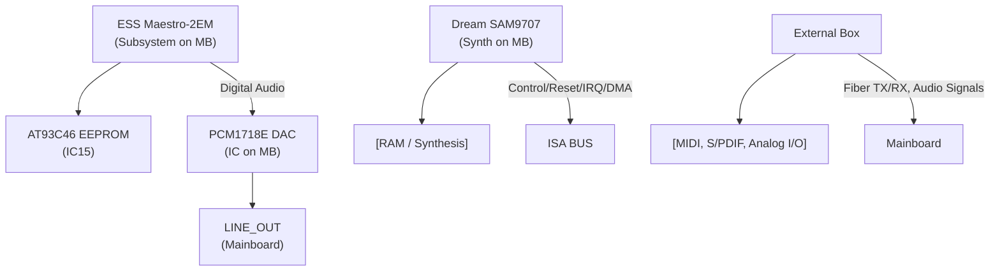

# Guillemot Maxi Studio ISIS Schematic Extraction (v0.7)

This document contains a structured technical extraction from the scanned schematic (version 0.7 by Jimmy Le Rhun, GPL, June 2003) for the **Guillemot Maxi Studio ISIS** PCI audio card. This information is intended to aid in reverse-engineering the card's hardware for driver development.

The schematic details the three main components of the system:
1.  **Mainboard Part 1: Maestro** (ESS ES1978MS / Maestro-2EM subsystem)
2.  **Mainboard Part 2: Dream** (SAM9707 wavetable synth subsystem)
3.  **Daughter Board** and **External Box** (connectors, S/PDIF, MIDI, and additional audio I/O)

---

## 1. Component Inventory

| Reference | Part Number | Function | Key Pins |
| :--- | :--- | :--- | :--- |
| **IC15** | [AT93C46](https://ww1.microchip.com/downloads/aemDocuments/documents/OTH/ProductDocuments/DataSheets/doc0172Z.pdf) | EEPROM | UCC, GND, DO, DI, SK, CS, ORS |
| **IC15** (page 2) | SRAM | SRAM | A0-A19, D0-D7, WE, CE |
| **PCM1718E** | [PCM1718E](https://www.ti.com/lit/ds/symlink/pcm1718.pdf) | 18-Bit Stereo Audio DAC | BCKIN, DIN, LRCIN, XTI, XTO, ZERO, FOR, DME, VCC, VDO, MUTE, RSTB, CLKO, D/C R, D/C L, OUTL, OUTR |
| **SAM9707** | [SAM9707](https://www.digchip.com/datasheets/download_datasheet.php?id=852066&part-number=SAM9707) | Dream Sound Synthesis Chip | A0-A22, D0-D15, CLK, OSC, CE, WE, RD, BOOT, RUN, RESET |
| **MK1413** | [MK1413](https://www.renesas.com/en/document/dst/mk1413-datasheet) | Low Power Audio Clock Source | CLK, GND, UCC, VCC |
| **PCM3001E** | [PCM3001E](https://www.ti.com/lit/gpn/PCM3001) | Audio Codec | DIN, DOUT, INR, OUTR, INL, OUTL, XTI, XTO, FMT0-FMT2, LACIN, BCKIN, RSTB, CPL, CLKIO, AGND2, UCC2 |
| **CS8414** | [CS8414](https://www.futurlec.com/Datasheet/Others/CS8414.pdf) | 96 kHz Digital Audio Receiver | ROXP, PACK, RXN, SCK, FSYNC, SDATA, VERF, ERF, FILT, FCK, SEL, VDD, DGND, UCC, AGND |
| **CS8402** | [CS8402](http://analogue-repair.it/Immagini/8402.pdf) | Digital Audio Transmitter | MCK, TXP, SCK, FSYNC, SDATA, RST, FCC0-2, CBL, PRO, VDD, GND |
| **PCM1728E** | [PCM1728E](https://www.ti.com/lit/ds/symlink/pcm1728.pdf?ts=1776389914809) | 24-Bit, 96 kHz Stereo Audio DAC | DIN, VOUT R, VOUT L, SYSCLK, XTI, XTO, BCK, LRCIN, BEKIN, FOR, DME, ZERO, CLKO, MUTE, RSTB, AGND1, AGND2, VCC1, VCC2 |
| **PCM1800E** | [PCM1800E](https://www.ti.com/lit/ds/symlink/pcm1800.pdf?ts=1776362069719) | 20-Bit Stereo A/D Converter | OUT, INR, INL, RSTB, REFI, REF2, CNR, CPR, MODEL, MODE1, SYSCLK, CPL, FSYNC, UCC, LRCK, VDD, BCK, AGND, DGND |
| **26C31** | [26C31](https://www.ti.com/lit/ds/symlink/am26c31.pdf?ts=1776345837407) | RS-422 Dual Differential Line Driver | (Standard pinout) |
| **26C32** | [26C32](https://www.ti.com/lit/ds/symlink/am26c32.pdf?ts=1776421866228) | RS-422 Dual Differential Line Receiver | (Standard pinout) |
| **74LS74D** | [74LS74D](https://www.futurlec.com/Datasheet/74ls/74LS74.pdf) | Dual D-Type Positive-Edge-Triggered Flip-Flop | PRE, D, CLK, CLR |
| **74AC14D** | [74AC14D](https://www.ti.com/lit/ds/symlink/cd74ac14.pdf?ts=1776421969319) | Hex Inverting Schmitt Trigger | (Standard pinout) |
| **74AC00D** | 74AC00D | Quad 2-Input NAND Gate | (Standard pinout) |
| **74AC860** | 74AC860 | Logic Gate | (Standard pinout) |
| **74AC140** | 74AC140 | Logic Gate | (Standard pinout) |
| **74LS140** | 74LS140 | Logic Gate | (Standard pinout) |
| **ES1978MS** | [ESS Maestro-2EM](https://www.dosdays.co.uk/media/ess/Maestro-2_Datasheet.pdf) | ESS Maestro-2EM PCI Audio Accelerator | - |

## 2. Netlist Extraction

### Buses

* **ISA BUS**: Appears on Page 1 and Page 2.
* **PCI BUS**: Page 1.
* **SRAM Address Bus (UA0-UA19)**: Page 2.
* **RAM Data Bus (D0-D7)**: Page 2.
* **DRAM Address Bus (HA0-HA10)**: Page 2.
* **DRAM Data Bus (HD0-HD15)**: Page 2.

### Critical Signals

* **MAESTRO_DOUT**: Digital audio output from Maestro subsystem to PCM1718E DAC.
* **MIDI_TXD**: MIDI transmit data signal.
* **MIDI_RXD**: MIDI receive data signal.
* **S/PDIF**: Fiber RX and Fiber TX signals on Page 4.
* **LINE_IN, LINE_OUT**: Audio input and output signals.
* **MIC_IN**: Microphone input signal.
* **AUX_IN**: Auxiliary input signal.
* **CD_IN**: CD audio input signal.
* **SRND_OUT**: Surround sound output signal.

---

## 3. Page-by-Page Breakdown

### Page 1: Maestro

* **Title Block**:
    * **TITLE**: isis2
    * **Date**: 09/06/2003
    * **Sheet**: 1/1
    * **Header Notes**: "Incomplete schematic of the Guillemot MAXI Studio ISIS soundcard", "(C) 2003 Jimmy Le Rhun."
* **Major Sections**: ESS Maestro-2EM subsystem, PCI interface, power section, AT93C46 EEPROM.
* **Key Chips**: ESS Maestro-2EM (ES1978MS), AT93C46 EEPROM (IC15).
* **Buses**: PCI BUS.
* **Power/Ground**: +5U, GND, -12U, +12U, JANTA.

### Page 2: Dream

* **Title Block**:
    * **TITLE**: isis2
    * **Date**: 09/06/2003
    * **Sheet**: 1/1
    * **Header**: Mainboard part 2 : Dream
* **Major Sections**: Dream SAM9707 synthesis subsystem, RAM (SRAM/DRAM) memory, PCM1718E DAC, digital audio section.
* **Key Chips**: Dream SAM9707, PCM1718E DAC, MK1413 clock source, PCM3001E codec.
* **Buses**: SRAM Address Bus, RAM Data Bus, DRAM Address Bus, DRAM Data Bus.
* **Power/Ground**: +5U, GND, UCC.

### Page 3: Daughter Board

* **Title Block**:
    * **TITLE**: isis2
    * **Date**: 09/06/2003
    * **Sheet**: 1/1
    * **Header**: Daughter board
* **Major Sections**: Connectors X7, logic circuitry (RS-422, logic gates), sampling clock generation, GPIO handling for the daughter board.
* **Key Chips**: RS-422 Drivers/Receivers (26C31/32), Logic Gates (74AC14D, 74AC860, 74AC140).
* **Buses**: GPIOB.
* **Power/Ground**: +5U, GND, +12V.

### Page 4: External Box

* **Title Block**:
    * **TITLE**: isis2
    * **Date**: 09/06/2003
    * **Sheet**: 1/1
    * **Header**: External Box
* **Major Sections**: MIDI THRU/OUT ports, S/PDIF interfaces (fiber RX/TX), S/PDIF receiver (CS8414) and transmitter (CS8402), multiple audio DACs and ADCs for line in/out on the external box.
* **Key Chips**: CS8414 S/PDIF receiver, CS8402 S/PDIF transmitter, PCM1728E DAC, PCM1800E ADC, Logic Gates (74LS140, 74LS740, 74AC00D).
* **Power/Ground**: +5U, GND, VDD, DGND, UCC, AGND.

---

## 4. Key Hardware Mappings

### PCI / ISA Bus Connections

* **PCI BUS**: Page 1. Detailed pin traces interface with the ES1978MS.
* **ISA BUS**: Pages 1 and 2. Traces show typical ISA signals such as `RESET`, `IRQ`, `DMA` pins routing for the Dream SAM9707 subsystem.

### MIDI TX/RX Paths

* **MIDI_TXD**: Traces from Maestro to daughter board/external box.
* **MIDI_RXD**: Traces from external box to Maestro.
* **Fiber RX/TX**: S/PDIF optical interfaces managed by CS8414 and CS8402.

### Audio Routing

* **Digital Audio**: `MAESTRO_DOUT` to `PCM1718E` DAC. `S/PDIF` signals bridge the mainboard and the external box.
* **Analog Audio**:
    * **Input**: CD_IN, MIC_IN, AUX_IN, LINE_IN on mainboard. Multiple LINE_INPUTs on external box routing to PCM1800E ADCs.
    * **Output**: LINE_OUT, Surround OUT on mainboard. Multiple LINE_OUTs on the external box.

### GPIO / Control Signals

* **Maestro GPIO**: General Purpose I/O pins control routing/modes on the ES1978MS.
* **Dream GPIO**: `GPIOC8..11` handled by SAM9707.
* **Daughter Board GPIO**: `GPIOB` and `GPIOL L` on daughter board connector.

### Clock Distribution

* **Audio Clocks**: `BIT_CLK`, `SCLK1`, `SCLK2`.
* **Dream Clocks**: `OSCI`, `OSCE`, `SAMPLING CLOCK`.
* **External Box Clocks**: `SYSC`, `BCK`, `LRCIN`, `BEKIN`, `CLIKO`.

### Reset / Power Sequencing

* **Reset**: `ARST`, `CRESET`, `RESET`. Crucial initialization lines for driver startup sequence.
* **Power**: JANTA (likely analog power), +5U, GND, -12U, +12U.

---

## 5. Reverse Engineering Value & Architecture Summary

* **Dual-Path Architecture**: The card operates via two distinct but bridged subsystems: the **ESS Maestro-2EM (ES1978MS)** handles standard PCI audio acceleration and routing, while the **Dream SAM9707** operates effectively as an embedded ISA-bus device managing wavetable synthesis and extended MIDI features. 
* **Initialization Sequence**: The `RESET` and `ARST` lines, combined with clock sources like `MK1413`, mandate a specific power-on sequence in the driver. The Dream SAM9707 requires its `BOOT` and `RUN` pins to be appropriately toggled, likely to load its microcode/firmware into the attached SRAM.
* **IRQ and DMA**: The Dream subsystem relies heavily on standard ISA `IRQ` and `DMA` logic, whereas the Maestro handles PCI interrupts. Mapping how the Maestro bridges these ISA interrupts to the PCI bus is a primary objective for driver mapping.
* **Audio Matrixing**: The presence of the `PCM3001E` codec and external `PCM1800E` / `PCM1728E` DACs/ADCs shows a complex I/O matrix. GPIO states on both the Maestro and SAM9707 act as crossbar switches to route I2S/digital audio between the mainboard, the synthesis engine, and the external breakout box.

## 6. Schematic Representation (Critical Paths)

