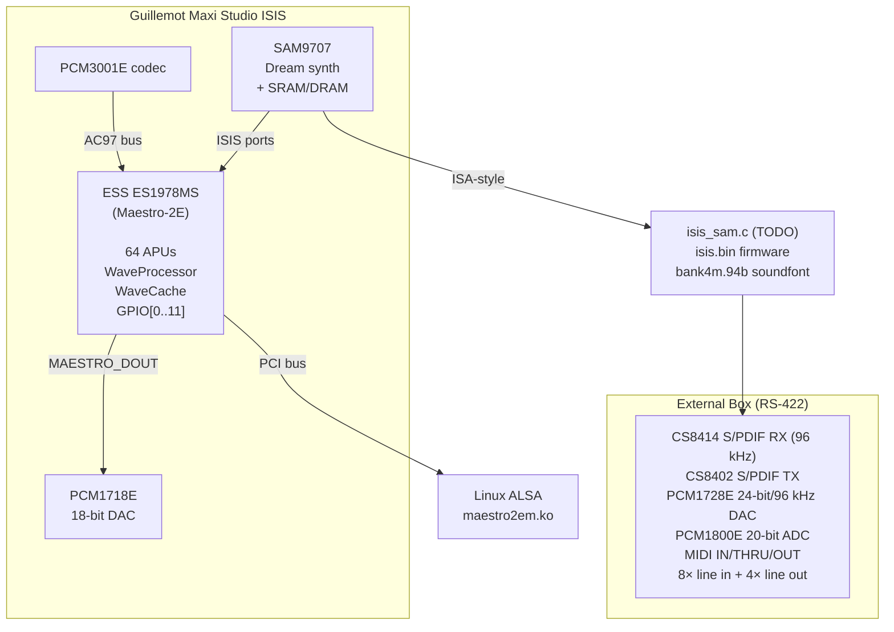

# ISISALSA — Linux ALSA driver for Guillemot Maxi Studio ISIS

Open-source ALSA driver for the **Guillemot Maxi Studio ISIS** PCI soundcard
(ESS Maestro-2E ES1978 audio engine).

**Status as of v0.5: build-ready, not yet run against real hardware.**
See [`TESTING.md`](TESTING.md) for a step-by-step guide if you have a
card — that's the single highest-value thing this project needs next.

## Hardware

| Component | Part | Role |
|---|---|---|
| Audio accelerator | ESS ES1978MS (Maestro-2E) | PCI audio, 64 APUs, AC97 bridge |
| Wavetable synth | Dream SAM9407/SAM9707 | MIDI synthesis (separate module, TODO) — see note below |
| Main DAC | PCM1718E | 18-bit stereo output |
| Codec | PCM3001E or ES1918 | AC97 mixer — both names appear across sources checked; likely sibling parts across board revisions, not confirmed as one or the other |
| S/PDIF RX | CS8414 | 96 kHz optical input (ext box) |
| S/PDIF TX | CS8402 | Optical output (ext box) |
| Hi-res DAC | PCM1728E | 24-bit/96 kHz (ext box) |
| ADC | 4× PCM1800E | 20-bit stereo record ×4 (ext box, 8ch total) |

**PCI ID:** `125D:1978` | **Subsystem:** `14AF:0010` (Guillemot Maxi Studio ISIS)

Card I/O: **8 inputs + 4 outputs** via external breakout box.

## Driver status

Confidence levels below distinguish "cross-checked against multiple
independent sources" from "confirmed on real hardware" — as of v0.5,
nothing has been run against a physical card yet.

| Feature | Status |
|---|---|
| PCM playback (stereo/mono, 16-bit/8-bit) | ✅ cross-checked, untested on hw |
| PCM capture (stereo 16-bit, on-board AC97) | ✅ cross-checked, untested on hw |
| AC97 mixer (snd_ac97) | ✅ cross-checked, untested on hw |
| PCI subsystem ID match | ✅ v0.4 |
| ES1978-specific WP registers | ✅ v0.4, cross-checked against official datasheet v0.5 |
| AC97 PR3 powerdown disabled | ✅ v0.4 |
| HW volume wheel correctly disabled | ✅ v0.4 |
| ACPI clock-gating safety (0x54-0x57) | ✅ v0.5, new |
| IDMA/SAM9707 bridge primitives | ✅ v0.5, new — see TESTING.md Stage 6 |
| **External 8-channel capture** (4×PCM1800E) | 🔲 genuinely unsolved — see below |
| SAM9707 firmware upload | 🔲 `isis_sam.c` (TODO) |
| S/PDIF I/O (CS8414/CS8402) | 🔲 TODO |
| MIDI (SAM9707 + MPU-401) | 🔲 TODO |
| Suspend/resume | 🔲 TODO |

### On external 8-channel capture specifically

This is the one feature that's had the most investigation and the
least resolution. What's confirmed: the SAM9707 has extra ADC-input
capability via GPIO-alternate-function pins (P1/P2/P3) beyond the base
SAM9407's single stereo input; all communication to the SAM chip goes
through the IDMA bridge (BAR0+0x44/0x46), not any Maestro-side audio
routing register; and a real GPIO sequence (bits 10/11) precedes burst
reads, confirmed by disassembly. What's still unconfirmed: the actual
SAM-side command(s) that select/format/trigger a capture stream. A
real, mature, vendor-assisted SAM9407 Linux driver (sam9407-1.0.4)
never implements more than stereo record on any card it supports, so
that avenue is exhausted. Real hardware testing (`TESTING.md` Stage 6)
is the current best path to closing this.

All values below were extracted from the original Guillemot Win9x drivers
(`maestro.inf` + `ES197X.vxd`) and are **hardware-confirmed**:

### PCI identity
```
PCI\VEN_125D&DEV_1978&SUBSYS_001014AF
SubVendor = 0x14AF  (Guillemot Corp.)
SubDevice = 0x0010  (Maxi Studio ISIS)
```

### ES1978-specific WP register init (from ES197X.vxd Object 1 @ 0x3BBC0)

| Register | ISIS value | Generic maestro.c | Note |
|---|---|---|---|
| WP[0x07] | `0x1540` | RMW~`0x0500` | ES1978-specific IDR7 |
| WP[0x08] | `0xB723` | `0xB004` | ES1978-specific |
| WP[0x09] | `0x001B` | `0x001B` | ✅ Confirmed same |
| WP[0x0A] | `0x5F1F` | `0x8000` | ES1978-specific |
| WP[0x0B] | `0xDF9F` | `0x3F37` | ES1978-specific |
| WP[0x0C] | `0x1377` | `0x0098` | ES1978-specific |
| WP[0x0D] | `0x7632` | `0x7632` | ✅ Confirmed same |
| WP[0x0E] | `0x0D16` | *(absent)* | ES1978-only register |

### Hardware flags (from maestro.inf registry keys)

| Flag | Value | Effect |
|---|---|---|
| `TurnOnOffExtAmp` | `0x01` | Amp via GPIO method 1 (GPIO pin 1) |
| `GPIOVal_BM/NOBM` | `0x09` | GPIO data = bits 0+3 for amp enable |
| `DisableHWVolCtrl` | `0x01` | **HW vol wheel disabled** — ESM_HIRQ_HW_VOLUME NOT set |
| `DisablePR3State` | `0x01` | AC97 analog mixer stays powered (PR3 cleared) |

## Bug fixes applied (cumulative from v0.1 → v0.4)

| # | Bug | Fix |
|---|---|---|
| 1 | APU CRAM access via wrong WP path | IDR1_CRAM_PTR → IDR0_DATA_PORT indirection |
| 2 | WaveCache ports wrong (`0x01FC/FD`) | Direct I/O `BAR0+0x10/0x12` |
| 3 | Clock reference 48000 Hz | `50MHz/1024 = 48828 Hz` |
| 4 | `compute_rate()` formula truncating | 48 kHz exact + full fixed-point |
| 5 | Chip init nearly empty | Full ring-bus, WP, WC, APU clear sequence |
| 6 | AC97 reset absent | GPIO cold-reset sequence added |
| 7 | WaveCache base regs unprogrammed | `WC[0x01FC-0x01FF]` = DMA pool PFN |
| 8 | `msleep()` inside spinlock | Spinlock removed from AC97 callbacks |
| 9 | Bob timer no `reg_lock` | `bob_start/stop` acquire `reg_lock` internally |
| 10 | Capture was stub | Full 4-APU chain (SRC + InputMixer) |
| 11 | Generic WP register values | ES1978-specific values from `ES197X.vxd` |
| 12 | PCI match too broad | `PCI_DEVICE_SUB(14AF, 0010)` added |
| 13 | HW vol IRQ wrongly enabled | `DisableHWVolCtrl=1` → bit cleared |
| 14 | AC97 PR3 powerdown active | `DisablePR3State=1` → PR3 cleared |

## Build

```bash
sudo apt install linux-headers-$(uname -r)
make
sudo insmod maestro2em.ko
dmesg | grep -i maestro
aplay -l
```

## Firmware (SAM9707 — separate module)

Place `isis.bin` (Guillemot ISIS firmware, `ISIS.V1.0.981225`) in
`/lib/firmware/`. **Do not use `PCI64.BIN`** — it is the upstream
DREAM SA blob and will not configure the ISIS card correctly.

`bank4m.94b` (4 MB GM soundfont) is required for wavetable MIDI
playback via the future `isis_sam.c` module.

## Source references

1. `maestro.c` v0.14 — Alan Cox / Zach Brown (OSS reference, 2000-01-28)
2. `ESMGR.VXD` — Win9x ESS Manager VxD (binary analysis)
3. `ES197X.DRV` — Win9x NE DLL (mixer path analysis)
4. `maestro.inf` v4.05.00.0427 — Guillemot INF, hardware config flags
5. `ES197X.vxd` 472 KB — Guillemot DirectSound VxD, ES1978 WP registers
6. ISIS schematic v0.7 — Jimmy Le Rhun (GPL, 2003)
7. `isis.bin` / `PCI64.BIN` — firmware image analysis
8. ESS Maestro-2 datasheet (104T31)

## Architecture

```
┌─────────────────────────────────────────────────────────┐
│ Guillemot Maxi Studio ISIS                              │
│                                                         │
│  ┌────────────────┐    MAESTRO_DOUT   ┌─────────────┐  │
│  │ ESS ES1978MS   │ ────────────────► │  PCM1718E   │  │
│  │ (Maestro-2E)   │                   │  18-bit DAC │  │
│  │                │    AC97 bus        └─────────────┘  │
│  │  64 APUs       │ ◄──────────────── PCM3001E codec    │
│  │  WaveProcessor │                                     │
│  │  WaveCache     │    ISIS ports      ┌─────────────┐  │
│  │  GPIO[0..11]   │ ◄──────────────── │  SAM9707    │  │
│  └────────┬───────┘                   │  Dream synth│  │
│           │ PCI                       │  + SRAM/DRAM│  │
│           │                           └─────────────┘  │
└───────────┼─────────────────────────────────────────────┘
            │ PCI bus                        │ ISA-style
            ▼                                ▼
       Linux ALSA                   isis_sam.c (TODO)
     maestro2em.ko                  isis.bin firmware
                                    bank4m.94b soundfont
                                         │
                              External Box (RS-422)
                         ┌───────────────┴──────────────┐
                         │ CS8414 S/PDIF RX (96kHz)     │
                         │ CS8402 S/PDIF TX              │
                         │ PCM1728E 24-bit/96kHz DAC    │
                         │ PCM1800E 20-bit ADC           │
                         │ MIDI IN/THRU/OUT              │
                         │ 8× line in + 4× line out     │
                         └──────────────────────────────┘
```


## License

GPL v2
